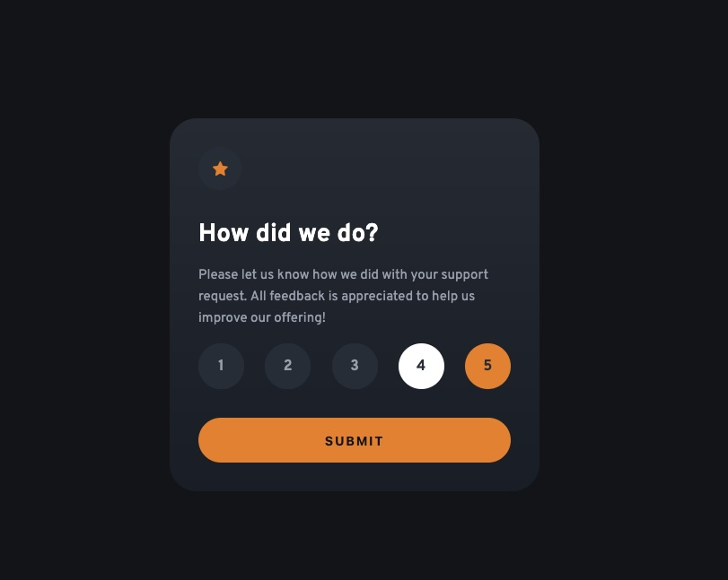

# Frontend Mentor - Interactive rating component solution

This is a solution to the [Interactive rating component challenge on Frontend Mentor](https://www.frontendmentor.io/challenges/interactive-rating-component-koxpeBUmI). Frontend Mentor challenges help you improve your coding skills by building realistic projects.

## Table of contents

- [Overview](#overview)
  - [The challenge](#the-challenge)
  - [Screenshot](#screenshot)
  - [Links](#links)
- [My process](#my-process)
  - [Built with](#built-with)
  - [What I learned](#what-i-learned)
  - [Useful resources](#useful-resources)
- [Author](#author)

## Overview

### The challenge

Users should be able to:

- View the optimal layout for the app depending on their device's screen size
- See hover states for all interactive elements on the page
- Select and submit a number rating
- See the "Thank you" card state after submitting a rating

### Screenshot

### Links

- Solution URL: [Solution](https://github.com/vince4dev/challenge15)
- Live Site URL: [Live site](https://vince4dev.github.io/challenge15/)

## My process

### Built with

- Semantic HTML5 markup
- CSS custom properties
- Flexbox
- CSS Grid
- Mobile-first workflow
- Javascript

### What I learned

- Customizing Form Elements:

  I implemented a group of custom radio buttons. To do this, I used an overlay technique: the native radio input is made invisible (but remains functional and focusable) and overlaid on an element styled using CSS. I used the :checked selector combined with the adjacent ~ selector to dynamically change the style of the selected button.

- Web Accessibility:

  One of my goals was to avoid sacrificing accessibility for design. Therefore, I added visible focus indicators (:focus-visible) for keyboard users and used appropriate labels to ensure correct reading by screen readers.

- JavaScript Logic & DOM Manipulation:

  Initialization: Implementation of a function to reset the state of radio buttons.

  Data Retrieval: Use of a change event listener to capture the value of the selected input.

  Dynamic Transition: Smooth transition between the "Rating" view and the "Thank You" view, with the selected rating inserted via template literals in the final HTML.

### Useful resources

- [google-webfonts-helper](https://gwfh.mranftl.com/fonts) - This helped me find the font and integrate it into the project.
- [MDN](https://developer.mozilla.org/fr/) - Resources for Developers.

## Author

- Frontend Mentor - [@vince4dev](https://www.frontendmentor.io/profile/vince4dev)
